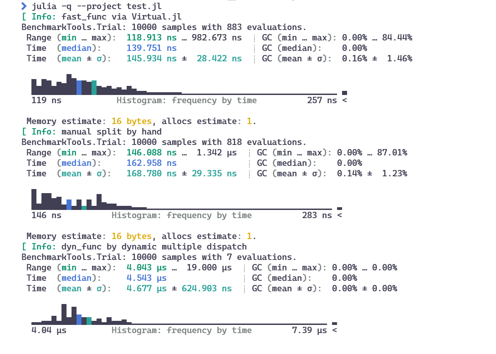

# Virtual

Virtual call in Julia, and calls are de-virtualized if possible!

[](https://thautwarm.github.io/Virtual.jl/stable/)
[](https://thautwarm.github.io/Virtual.jl/dev/)
[](https://github.com/thautwarm/Virtual.jl/actions/workflows/CI.yml?query=branch%3Amain)

- Requirement: Julia >= 1.6 (You can build this package for Julia 1.1+ by invoking `bash.sh`)

This package can be regarded as a generalization to ValSplit.jl. Virtual functions created with this package bring us the following features:

- **No virtual call when it's statically decidable!**
- Otherwise, use an efficient virtual call that is slightly **faster than a manual if-else split**!
- Support multiple dispatch, i.e., not single dispatch on the first parameter!

This package aims to address an issue in practice: container manipulation used to be considerably slow in Julia, if the element type is abstract.

**The following code shows how Virtual.jl speeds up multiple dispatch in a factor of 40 when processing containers with abstract element types.**

```julia
using Virtual, BenchmarkTools
abstract type Animal end
struct Dog <: Animal end
struct Tiger <: Animal end
struct Duck <: Animal end

@virtual fast_func(x::Animal, y::Int) = error("No default method for score!")
@override fast_func(x::Dog, y::Int) = 2 + y
@override fast_func(x::Tiger, y::Int) = 3 + y
@override fast_func(x::Duck, y::Int) = 4 + y

dyn_func(x::Animal, y::Int) = error("No default method for score!")
dyn_func(x::Dog, y::Int) = 2 + y
dyn_func(x::Tiger, y::Int) = 3 + y
dyn_func(x::Duck, y::Int) = 4 + y

manual_func(x::Animal, y::Int) =
    if x isa Dog
        2 + y
    elseif x isa Tiger
        3 + y
    elseif x isa Duck
        4 + y
    else
        error("No default method for score!")
    end

const samples = Animal[Dog(), Duck(), Tiger()]
animals = Animal[samples[rand(1:3)] for i = 1:100]

function sum_score(score_func, xs::AbstractVector{Animal})
    s = 0
    for x in xs
        s += score_func(x, 3)
    end
    return s
end

@info "fast_func via Virtual.jl"
display(@benchmark(sum_score(fast_func, animals)))
@info "manual split by hand"
display(@benchmark(sum_score(manual_func, animals)))
@info "dyn_func by dynamic multiple dispatch"
display(@benchmark(sum_score(dyn_func, animals)))

```

The results are given as follow:

